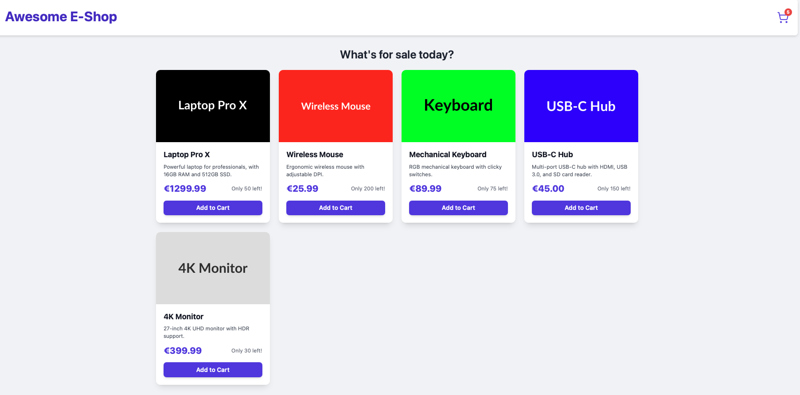
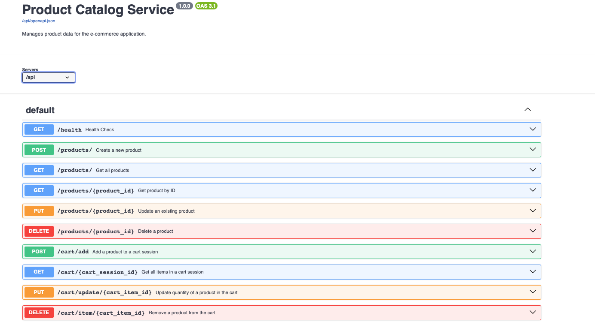

# E-commerce Monitoring Application (Multi-Technology Microservices)
This project is a sample e-commerce application designed with a microservices architecture using a diverse set of technologies. Its primary purpose is to serve as a demonstration platform for Application Performance Monitoring (APM) tools like Dynatrace, IBM Instana, and AppDynamics, showcasing distributed tracing, performance metrics, and inter-service communication in a heterogeneous environment.

The application aims to mimic a simplified version of a large-scale e-commerce platform like Amazon, focusing on creating observable interactions across different technology stacks.

## Project Goal
To build a multi-technology microservices application that can be easily containerized with Docker and orchestrated with Kubernetes, providing a rich environment for comprehensive APM tool evaluation and demonstration.

## Architecture & Technologies
The application is structured as a set of independent microservices, each potentially using a different technology stack.

* **Current Services:**

    * **Frontend Application (React):** User-facing web interface. Built with React and served by Nginx.

    * **Nginx Reverse Proxy:** Acts as the entry point, serving the React static files and proxying API requests to the backend service.

    * **API Gateway / Frontend BFF (Node.js / Express):** The primary entry point for the frontend, routing and aggregating calls to backend services.

    * **User & Authentication Service (Java / Spring Boot / MySQL):** Handles user registration, login, and authentication.

        * **Technology:** Java 17+, Spring Boot, MySQL.

        * **Database:** MySQL.

        * **Containerization:** Docker.

    * **Product Catalog Service (Python / FastAPI / MySQL):** Manages product data (CRUD operations, search, filtering) and stock levels.

        * **Technology:** Python 3.9+, FastAPI, SQLAlchemy, MySQL.
        
        * **Database:** MySQL.

        * **Containerization:** Docker.

* **Planned Services:** (Future additions to expand the microservices architecture)

    * User & Authentication Service (Java / Spring Boot): Handles user registration, login, and authentication.

    * Order Processing Service (.NET / ASP.NET Core): Manages the order lifecycle.

    * Inventory Service (Node.js): **(Deferred)** The core functionality of managing product stock is currently handled by the Product Catalog Service. A dedicated microservice would be needed for more complex inventory management, such as low-stock alerts or multiple warehouses.

## Observability Focus

A core aspect of this project is its design for monitoring and observability. Future integrations will include:

* **Structured Logging:** Consistent logging with trace/span IDs.

* **Metrics Exposure:** Application-specific metrics for performance analysis.

* **Distributed Tracing (OpenTelemetry):** End-to-end transaction visibility across all services.

* **Health Checks:** Standardized endpoints for liveness and readiness probes.

## Setup and Running the Application
This guide assumes you have Docker installed and running on your system.

**1. Project Structure**

Ensure your project directory is structured as follows:
```
ecommerce-monitoring-app/
├── api-gateway/
│   ├── Dockerfile
│   ├── package.json
│   └── server.js
├── user-service/
│   ├── pom.xml
│   ├── src/
│   │   └── ...
│   └── Dockerfile
├── product-catalog-service/
│   ├── main.py
│   ├── requirements.txt
│   └── Dockerfile
├── frontend/
│   ├── public/
│   │   ├── images/
│   │   │   ├── catalog_api.png
│   │   │   └── home.png
│   │   └── index.html
│   ├── src/
│   │   ├── App.js
│   │   └── index.js
│   ├── package.json
│   └── Dockerfile
├── nginx/
│   ├── nginx.conf
│   └── Dockerfile
├── docker-compose.yml
└── .gitignore
└── README.md
```
**2. Docker Compose Configuration**

The ```docker-compose.yml``` file orchestrates all services: the MySQL database, the Product Catalog Service, a frontend builder, and the Nginx reverse proxy, connecting them to a shared Docker network.

***(The full ```docker-compose.yml``` content is in the file itself, not replicated here for brevity and to avoid redundancy.)***

**3. Build and Run Services**

Navigate to the root of your ```ecommerce-app``` directory in your terminal:
```
cd ecommerce-app
```
First, perform a clean shutdown and remove any old containers/volumes to ensure a fresh start:
```
docker compose down --volumes --remove-orphans
```
Next, build all the necessary Docker images:
```
docker compose build

```
Finally, start all services in detached mode:

```
docker compose up -d
```
This command will:

* Create and start the ```mysql_db``` container.

* Create and run the ```ecommerce_frontend_builder container```, which builds the React app and then exits.

* Create and start the ```user_auth_app``` container.

* Create and start the ```product_catalog_app``` container ensuring it waits for the database to be healthy.

* Create and start the ```api_gateway``` container.

* Create and start the ```ecommerce_nginx``` container, which serves the built React app and proxies API requests to the ```api_gateway```.

**4. Verify Services**

Check that both containers are running:
```
docker ps
```
You should see ```mysql_db```, ```user_auth_app```, ```product_catalog_app```, ```api_gateway```, and ```ecommerce_nginx``` listed with a ```Up``` status. The ```ecommerce_frontend_builder``` container should show as Exited.

**5. Access the Application**

* **Frontend Application:**

    Open your web browser and navigate to:
    
    ```
    http://localhost
    ```

    You should see the E-commerce Store frontend displaying products.

    

  **New Feature: Add to Cart**
    
    * **Add to Cart:** Clicking the "Add to Cart" button on any product sends a request to the backend, updates a simulated cart count, and decreases the product's stock level.
    * **Clear Cart:** A new "Clear Cart" button on the cart page sends a request to the backend, which removes all items from the cart and returns the stock to the product catalog. 

* **Product Catalog Service API Docs (via API Gateway):**  You can access the FastAPI interactive documentation (Swagger UI) by navigating through the API Gateway, which Nginx proxies to:

```
http://localhost/api/docs
```

From the Swagger UI, you can test the API endpoints (e.g., ```GET /products/```, ```POST /products/```).

* The API documentation is now fully accessible and interactive via the Nginx proxy.

* Test the ```GET /health``` endpoint to confirm the service and database connection are healthy.

* Use the ```POST /products/``` endpoint to add new products to the catalog.

* Use ```GET /products/``` to retrieve all products.



## Development
**Adding New Services**

When adding a new microservice:

1.  Create a new directory for the service (e.g., ```user-service/```).

2.  Develop your service logic in the chosen technology (e.g., Java Spring Boot, Node.js Express).

3.  Create a ```Dockerfile``` for the new service.

4.  Add the new service to your ```docker-compose.yml``` file, defining its build context, ports, environment variables, and network.

5.  Update the ```README.md``` to reflect the new service.

**Monitoring Integration**

Future steps will involve integrating OpenTelemetry (or specific APM agent SDKs) into each service to emit traces, metrics, and logs, making the entire application observable.

This README provides a solid foundation.